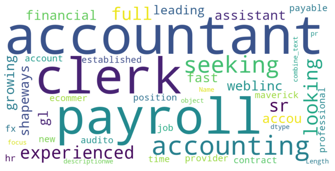
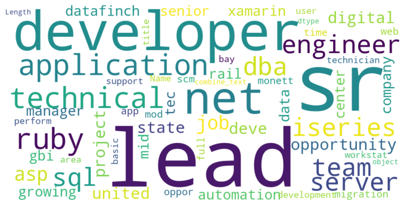
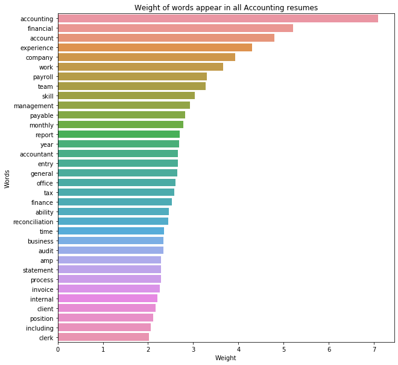
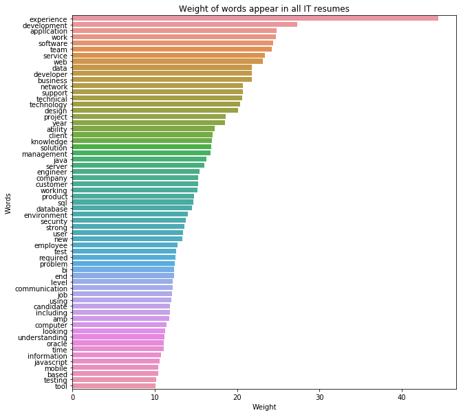
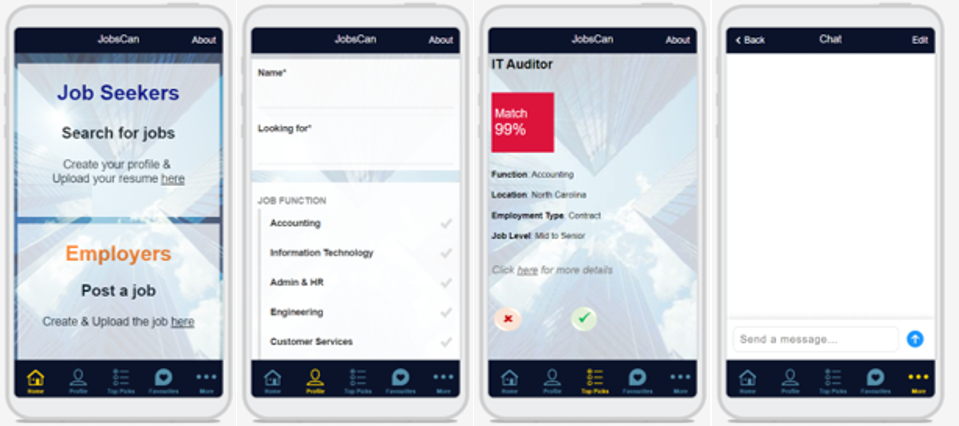

#  Capstone - Resumes and Job Ads Recommender

### Overview

#### Problem Statement

HR practitioners and/or hiring managers could have been spending too much time trying to sieve through many resumes for shortlisting suitable candidates whom they can contact for interview.
As a job seeker, we may also find ourselves spending so much times looking through plentiful job advertisements which may not be relevant to us.
Wouldn't it be nice if pre-selection can be done which will effectively save time for all of us?

We will be using Natural Language Processing (NLP) and Recommender System. Using cosine similarity, to identify similar job seekers / job advertisements.
Success will be evaluated based on the top recommendations and its features to see how closely matched are the jobs for the job seekers and vice versa.

---

### Executive Summary

#### Business Overview and Process

We scrape the website jobspider.com for resumes. In view that api key is not available, we used BeautifulSoup and regex to get the desired information. As we encounter roadblock on the time connection timeout despite introducing bot agent, we limit the job categories to Accounting and Information Technology for this capstone. 
For the job ads, we based it on existing dataset that is available on Kaggle which was used for predicting fake job posting since the features in this dataset has 80% simiarity to the resumes dataset.

As we were cleaning the resumes dataset,we also decide which features will be important for us to have and which are the one to drop. In view that job title, objective, experience and skills are free texts that hold meaningful words for our analysis, we create a new feature and combine all where we then split the text into words, return them to their root form and also remove the stop words. These are performed for the job ads dataset as well.
We use TFidfVectorizer to calculate the weight of the words and not surprisely, words appear in resumes and often found in job ads.

For feature selection, we picked `location`, `education level`, `employment type`, `function`, `job level` as our initial criteria. We then put these features through cosine similarity metric, measuring the consine of the angle the features projected in a multi-dimension space to determine their similarity.

Noting that our dataset comprises of both job ads and resumes, we then need to slice the dataset together with the similarity scores that showcase resumes on the row index and job ads on the columns.

With that, we will be able to filter based on resumes returning top similarity scores for job ads and by tranposing the dataset, we then will also be able to get recommendated resumes based on similarity scores against job ads.

---
### Datasets

#### Datasets saved and created

- [Accounting](./datasets/Accounting.csv)
- [IT](./datasets/IT.csv)
- [job_ads](./datasets/job_ads.csv)
- [resumes](./datasets/resumes.csv)
- [res_jobs](./datasets/res_jobs.csv)

#### Datasets researched and used for scraping

https://www.jobspider.com/ \
https://www.kaggle.com/shivamb/real-or-fake-fake-jobposting-prediction \ 
https://www.worldatlas.com/articles/the-regions-of-the-united-states.html \
https://ideal.com/resume-screening/

#### Data Dictionary

| Data Dictionary for resume 	|                                                                                           	|
|:----------------------------	|:-------------------------------------------------------------------------------------------	|
| date_posted                	| the date resume was posted                                                                	|
| job_title                  	| job title that the candidate is looking for                                               	|
| industry                   	| job industry                                                                              	|
| state                      	| postal abbreviation of the state name                                                     	|
| state_name                 	| name of the US state                                                                      	|
| resume_href                	| link to join with url for entering resume                                                 	|
| id                         	| candidate respective resume id                                                            	|
| emp_type                   	| employment type e.g. full time/part time permanent, contract, etc                         	|
| availability               	| date that the candidate is available                                                      	|
| desired_wage               	| desired wage of the candidate                                                             	|
| work_auth                  	| if the candidate is authorized to work in USA                                             	|
| job_level                  	| job level of the candidate e.g. Executive (President, VP, CEO), new grad/entry level, etc 	|
| will_travel                	| if candidate is willing to travel if job is required                                      	|
| edu_level                  	| candidates' education level e.g. bachelors, masters, etc                                  	|
| will_reloc                 	| if candidate is willing to relocation if job is required                                  	|
| objective                  	| candidate's written objective, similar to an executive summary                            	|
| exp                        	| candidate's experience of past jobs                                                       	|
| edu                        	| candidate's education in details                                                          	|
| skills                     	| candidate's skills e.g. Microsoft office, financial reporting, etc                        	|
| add_info                   	| additional information of the candidates                                                  	|

---

### Summary

#### Web Scraping

Due to timeout error, we are unable to scraped all jobs from the website, thus, we ended up with 2 job categories for resumes namely Accounting and Information Technology.

#### Data cleaning / EDA

As we were cleaning the resumes dataset, we at the same made decision which features will be important for us to have and which are the one to drop. In view that job title, objective, experience and skills are free texts that hold meaningful words for our analysis, we create a new feature and combine all where we then split the text into words, return them to their root form and also remove the stop words. These are performed for the job ads dataset.

A quick look of the wordcloud visualization:

Wordcloud for Accounting resumes\

Wordcloud for Accounting job ads\

Wordcloud for Information Technology resumes\

Wordcloud for Information Technology job ads\

We also used TFidfVectorizer to check out on the weight of the words:

A comparison shows that the top words that appear with the most weight are quite similar in both resumes and job ads.\
E.g. Accounting, financial, account, management, payroll, payable, etc
E.g. Network, project, management, development, software, data, etc

Weight of words (Accounting resumes)\

Weight of words (Accounting job ads)\

Weight of words (Information Technology resumes)\

Weight of words (Information Technology job ads)\

#### Pre-processing and Recommender Systems

For feature selection, we picked `location`, `education level`, `employment type`, `function`, `job level` as our initial criteria. We then put these features through cosine similarity metric, measuring the consine of the angle the features projected in a multi-dimension space to determine their similarity.

| Data Dictionary selected features 	|                                                                                                        	|
|:-----------------------------------	|:--------------------------------------------------------------------------------------------------------	|
| function                          	| Accounting = 1 and Information Technology = 5                                                          	|
| state_name                        	| Assigned number to each state in alphabetical order                                                    	|
| emp_type                          	| internship = 1, part-time = 2, contract = 3, full-time = 4, other = 5                                  	|
| job_level                         	| internship = 1, entry_level = 2, associate = 3, mid_senior = 4, executive = 5                          	|
| edu_level                         	| unspecified = 1, high_school = 2, college = 3, certificate = 4, degree = 5, bachelors = 6, masters = 7 	|
| region                            	| states by region where west = 1, midwest = 2, south = 3, northeast = 4                                 	|

Noting that our dataset comprises of both job ads and resumes, we then need to slice the dataset together with the similarity scores that showcase resumes on the row index and job ads on the columns.

With that, we will be able to filter based on resumes returning top similarity scores for job ads and by tranposing the dataset, we then will also be able to get recommendated resumes based on similarity scores against job ads.

Example of top 10 recommended jobs for job seeker id 82470 looking or auditor job:

|                                       Recommender Systems 	|   function 	|     state_name 	|  emp_type 	|  job_level 	| edu_level 	| region    	|
|----------------------------------------------------------:	|-----------:	|---------------:	|----------:	|-----------:	|----------:	|-----------	|
|                                           R_82470_auditor 	| Accounting 	|          Texas 	|  contract 	| mid_senior 	|   masters 	|     south 	|
|                                         J_915_IT- Auditor 	| Accounting 	| North Carolina 	|  contract 	| mid_senior 	| bachelors 	|     south 	|
|                                  J_6736_Senior Accountant 	| Accounting 	|          Texas 	|  contract 	|  associate 	| bachelors 	|     south 	|
|           J_4871_CPA Accounting Manager / Medical Billing 	| Accounting 	|          Texas 	| full-time 	| mid_senior 	| bachelors 	|     south 	|
|                            J_701_Accountant / Book Keeper 	| Accounting 	|       Virginia 	| full-time 	| mid_senior 	| bachelors 	|     south 	|
| J_4873_Controller - High Growth Specialty Finance Company 	| Accounting 	|       Virginia 	| full-time 	| mid_senior 	| bachelors 	|     south 	|
|                        J_2128_Accounts Payable Supervisor 	| Accounting 	|       Oklahoma 	| full-time 	|  associate 	| bachelors 	|     south 	|
|                                          J_687_Accountant 	| Accounting 	|       New York 	| full-time 	| mid_senior 	| bachelors 	| northeast 	|
|                                 J_3057_Accounting Manager 	| Accounting 	|          Maine 	| full-time 	| mid_senior 	| bachelors 	| northeast 	|
|                               J_6081_Corporate Controller 	| Accounting 	|       New York 	| full-time 	| mid_senior 	| bachelors 	| northeast 	|
|                                J_10433_Payroll Accountant 	| Accounting 	|   Pennsylvania 	| full-time 	| mid_senior 	| bachelors 	| northeast 	|

### Conclusion, Limitation and Future Workds

#### Conclusion:
Study shows that resumes screening remains the most time-consuming part of recruiting process where 52% of Talent Acquisition leaders cited that the hardest part of recruitment is screening candidates from a large applicant pool.
This process takes approximately 23 hours for just one hire and typically 75% to 88% of the resumes from the pool are unqualified.

Likewise for job seekers, we tend to send out tons of application only to hear nothing back in return. In addition, to ensure that the resume stands out, it is strongly recommended to tailor made the application materials to each job application. 

What we are trying achieve with the above model is to be able to take away the time-consuming part of the work for both recruitment process and job seekers.
This recommender system will return best-match profiles / job ads. So for the talent acquisition / job seekers, instead of looking through the large pool of information, they will be able to just focus on the recommendation which will already be matched based on their requirements.

With this recommendations, we plan to introduce a selection function (`Yes` or `No`). Talent acquisition leader / job seekers can have the option to choose `Yes` or `No` where yes to show interest and no refers to not interested.
When both job seeker and talent acquisition leader selected `Yes`, they will be connected to a chatroom to kickstart their conversation.

Visualization of JobsCan app \

#### Limitation and Future Works:
**1. Unsupervised learning**\
The current metric is based on unsupervised learning. Upon successful implementation, as we go along, we will be able to collect more data on the success rate of matching or hire based on our recommendation. From there, we can ehance our metric to include supervised learning for better recommendation in the future.

**2. Adapt to local data**\
Currently, both dataset are US based data. Next, we need to explore to scrape local data, otherwise collect data through the app.

**3. Include all functions**\
To include more functions so that the app can cater to wider community.
FOCUS: General workers or student looking for part-time assignment to earn quick bucks. As there are many platforms to increase efficiency on recuitment for white collars / PMETs / Executive. This app aims to match quickly manpower that are needed urgently such as promoters, buffers, etc. Such roles typically don't require long interview process, thus the chat function allows employer to quickly connect to the job seeker for providing work information.

**4. Skill sets**\
As we observed earlier in EDA, job descriptions could consist of not only job description but experience, skills, compensation benefits, etc. The information we needed was the skill sets for better matching.
We need to further clean the data to capture the 'right' skill sets from multiple features.
Additionally, some function generally require more different skills and given the fast pace changing environment, need to take into consideration maintenance work for updating the set of skills.

