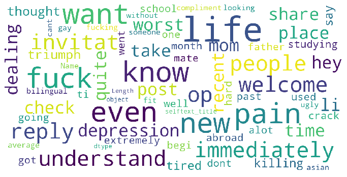
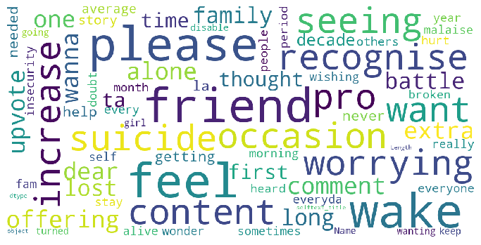

# Project 3: Web APIs & Classification

### Overview

#### Problem Statement

To help counselor, schools and even parents to identify individual who potentially could hold suicidal thoughts. By analysing existing posts in Reddit, we want to use multiple prediction models for identifying the best model to apply on text written by individual that could predict if this individual holds any suicidal thought, allowing immediate intervention and render support to these group of individuals.

Beside aiming for accuracy of our prediction, we also want to target at the individual who falls under the depresssion category but somehow our prediction shows that this individal is in the suicidual category.

Using Natural Language Processing, success is evaluated by the model has the highest score that combine both accuracy and recall.​

---

### Executive Summary

#### Business Overview and Process

Using Reddit's API, we will be scraping through the subreddits of 2 posts namely Depression and SuicideWatch.

After examining the scrapped data, we see that the posts itself and the title both hold meaningful words for our analysis. So, we combine these 2 together and apply techniques to split the text into words, return them to their root form and also remove the stop words.
1 interesting outcome was that we ended up having 1 empty post as all words are actually stops words. Since it became an empty post, we decided to drop that post for our analysis.

Once we have cleaned the datasets, we start with putting it into our first modelling which is a simple combination of CountVectorizer and LogisticRegression. Comparing to the baseline accuracy of 51%, this basic model has a better score however it is overfitting.

Using the same model, we added in pipelines and gridsearch to look for the best parameters and see if it will improve the score. The result shows that the variance was greatly reduced however, the accuracy needs to be improved.

We run a function that uses 2 vectorizers (CountVectorizer and TfidVectorizer) with 3 models (LogisticRegression, MultinomialNB and KNeighborsClassifier. That gives a return of 6 results.
As mentioned in the problem statement, we are looking out for individual who fall under the depression category but our prediction shows otherwise. This are the false negatives result we are looking at and thus apart from the accuracy, we will also be focusing on the recall score.

---
### Datasets

#### Datasets saved and created

- [depress](./datasets/depress.csv)
- [suicide](./datasets/suicide.csv)
- [depress_clean](./datasets/depress_clean.csv)
- [suicide_clean](./datasets/suicide_clean.csv)

#### Datasets researched/Subreddits used for scraping

https://www.reddit.com/r/depression \
https://www.reddit.com/r/SuicideWatch

#### Data Dictionary

| Features       	| Descriptions                                                                	|
|:----------------	|:-----------------------------------------------------------------------------	|
| selftext       	| Posts written by subreddits communities                                     	|
| title          	| Title/header of the posts                                                   	|
| selftext_title 	| Combination of both the posts and title                                     	|
| is_suicide     	| posts from SuicideWatch subreddits = 1 posts from Depression subreddits = 0 	|

---

### Summary

#### Web Scraping

Picked 2 subreddits namely SuicideWatch and Depression for scraping.

#### Data cleaning / EDA

After examining the scrapped data, we see that the posts itself and the title both hold meaningful words for our analysis. So, we combine these 2 together and apply techniques to split the text into words, return them to their root form and also remove the stop words.

1 interesting outcome was that we ended up having 1 empty post as all words are actually stops words. Since it became an empty post, we decided to drop that post for our analysis.

A quick look of the wordcloud visualization:

Wordcloud for Depression\

Wordcloud for SuicideWatch\

#### Data Modeling and Evaluation

Once we have cleaned the datasets, we start with putting it into our first modelling which is a simple combination of CountVectorizer and LogisticRegression. Comparing to the baseline accuracy of 51%, this basic model has a better score however it is overfitting.

Using the same model, we added in pipelines and gridsearch to look for the best parameters and see if it will improve the score. The result shows that the variance was greatly reduced however, the accuracy needs to be improved.

We run a function that uses 2 vectorizers (CountVectorizer and TfidVectorizer) with 3 models (LogisticRegression, MultinomialNB and KNeighborsClassifier. That gives a return of 6 results.
As mentioned in the problem statement, we are looking out for individual who fall under the depression category but our prediction shows otherwise. This are the false negatives result we are looking at and thus apart from the accuracy, we will also be focusing on the recall score.

| Modelling summary 	| 1        	| 2        	| 3        	| 4        	| 5        	| 6        	|
|:-------------------	|:--------:	|:--------:	|:--------:	|:--------:	|:--------:	|:--------:	|
| vectorizer        	| cv       	| cv       	| cv       	| tv       	| tv       	| tv       	|
| model             	| lr       	| mnb      	| knn      	| lr       	| mnb      	| knn      	|
| train_score       	| 0.908022 	| 0.848548 	| 0.56639  	| 0.883817 	| 0.881743 	| 0.696404 	|
| test_score        	| 0.695652 	| 0.708075 	| 0.596273 	| 0.710145 	| 0.724638 	| 0.660455 	|
| ROC_AUC score     	| 0.69489  	| 0.706931 	| 0.589765 	| 0.709658 	| 0.7235   	| 0.659411 	|
| accuracy          	| 0.695652 	| 0.708075 	| 0.596273 	| 0.710145 	| 0.724638 	| 0.660455 	|
| f1_score          	| 0.711198 	| 0.728324 	| 0.703196 	| 0.721116 	| 0.743738 	| 0.682171 	|
| recall_score      	| 0.735772 	| 0.768293 	| 0.939024 	| 0.735772 	| 0.784553 	| 0.715447 	|
| precision_score   	| 0.688213 	| 0.692308 	| 0.562044 	| 0.707031 	| 0.70696  	| 0.651852 	|

`True negatives`: Predict depression ; depression\
`False positives`: Predict suicide ; depression\
`False negatives`: Predict depression ; suicide\
`True positives`: Predict suicide ; suicide\
While we want ensure we have good prediction of suicide cases, we also need to be able to capture the `false negatives` cases where the predictions indicate depression but turn out to be suicidal.
Thus, we will compare recall score and pick the best model.\
\
That being said, thou model 3 (CountVectorizer and KNN) return the highest recall score among all the models, the accuracy was rather low (although still better than baseline accuracy of 51%) which should be our 1st priority. Therefore, I won't be selecting this model.
Instead, I will be aiming at model 5 (TfidVectorizer and Multinomial). It has the highest accuracy score (72%) yet having a relative high recall (rank 2nd at 78%).

### Conclusion and Recommendations

#### Summary and conclusion:

Conclusion:
- The selected model that we use for prediction is a combination of TfidVectorizer and MultinomialNB.
- The best parameters for TfidVectorizer are with 2000 features, max_df at 85%, min_df at 2 with ngram_range=(1,1).
- Apply MultinomialNB model, it gives us a accuracy and recall score of 72% and 78% respectively.
- And focusing on the False negative results, it represent an approx. 11% (53 out of 483).

Given this result, not only we can predict individuals with suicidal thoughts, we are also able to pick up those who are probably in the depression phase but starts to exhibit suicidal thoughts. This allows immediate intervention to prevent any mishap plus sending support and help to the individual to overcome this period.

Area of improvements:
- Stopwords. Recalling we removed an empty post due to stopwords ('what should i do'). However, in this context, this whole text seems to suggest some signal sending from the individual. Thus, in my opinion, it is also critical to investigate further.
- Lemmetization. During EDA, spotted words such as depressed and depression / suicide and suicidual were somehow not return to the basic form.
- Overlapping words. The overlap words (naming a few examples: want, know, life, like, etc) seems to be borderline stop words. Words like want and know need to be pair with other words to make out some meaning. Maybe, we need to look into the n-gram paratemeters again.